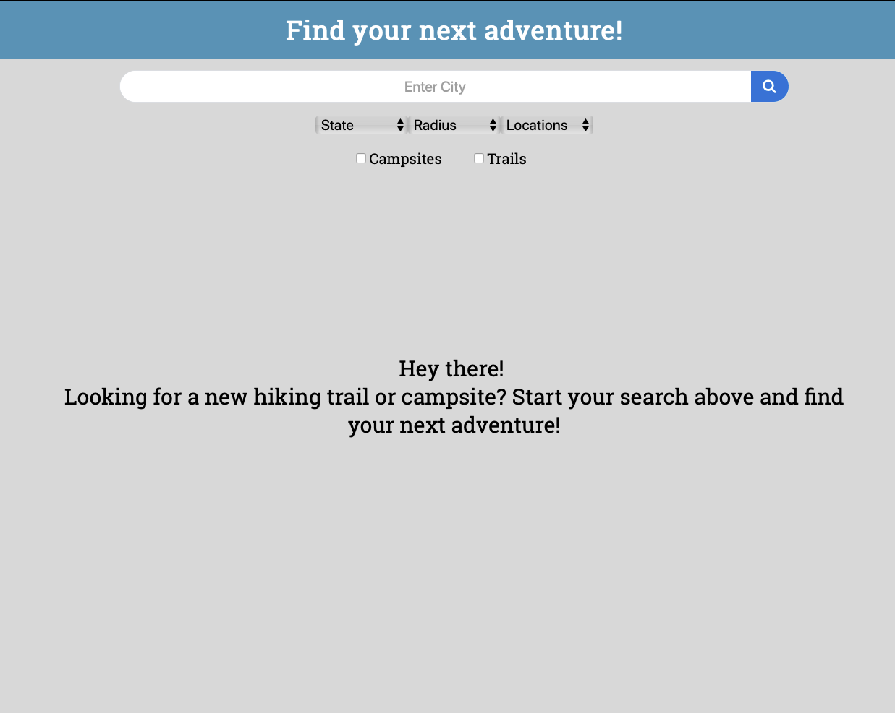
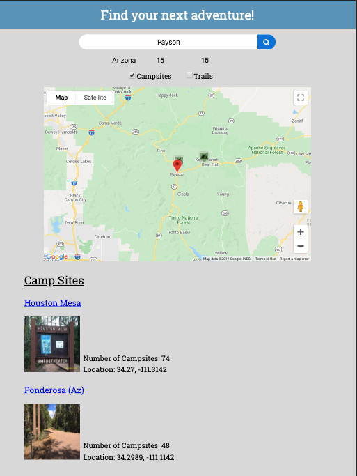
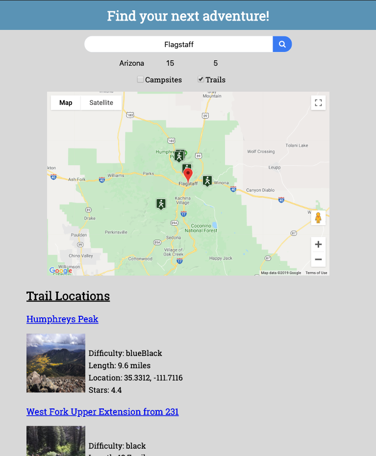
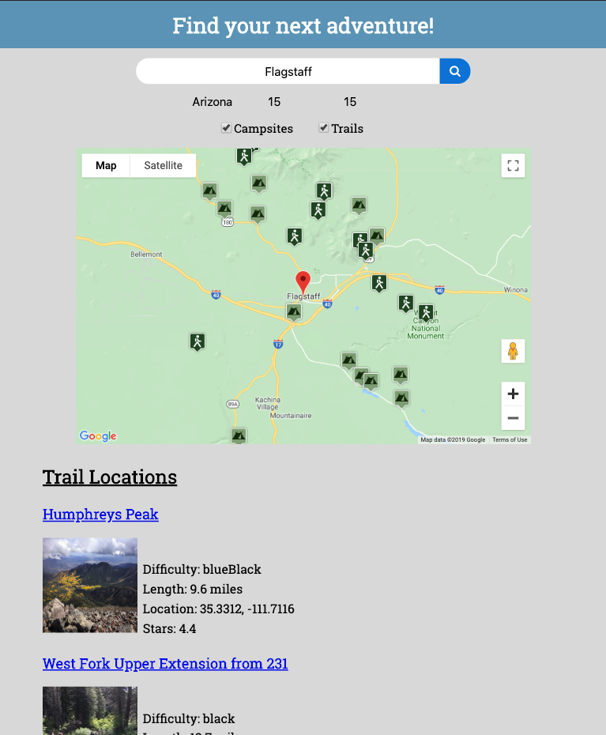

# Camping-and-Hiking-Trails

Live Repo: https://jon-k-1232.github.io/Camping-and-Hiking-Trails/.

Description
The way this app is used is it pulls trails and camp sites from REI's web api in order to find new camping spots and trails for a user to view. The flow starts with required user input city, state, search radius, number of requested hits. The user may opt to find either campsites, trails, or both. The user input is then put through google Geo to get the latitude and longitude so that the api web address can be created. Once the lat/long is obtained from google it must be converted to lat/long abbreviations that REI recognizes in order to run each of their API’s. Depending on if the user opted to obtain only camping spots, trails or both the code will go to the respective functions to run the API’s for either camping spots or trails. Once the api responds the DOM is manipulated with the returned information.

Technologies used:
HTML
CSS3
JavaScript
jQuery
Google geo
Google maps/markers
REI hiking project API

Landing Page:

Campspots Only

Trails Only

Trails and camping spots

